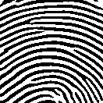

<!--
 * @Description:
 * @Author: Xiongjun Guan
 * @Date: 2025-04-28
 * @version: 0.0.1
-->

# Finger Pose Estimation for Under-screen Fingerprint Sensor

<h5 align="left"> If our project helps you, please give us a star ⭐ on GitHub to support us. 🙏🙏 </h2>

<br>

  <a src="https://img.shields.io/badge/cs.CV-2505.02481-b31b1b?logo=arxiv&logoColor=red" href="https://arxiv.org/abs/2505.02481" height="25"> 
</a>

<p align="LEFT" >
<a></a>
</p>

### :speech_balloon: This repo is the official implementation of:

- **_Under Review_**: [Finger Pose Estimation for Under-screen Fingerprint Sensor]()

[Xiongjun Guan](https://xiongjunguan.github.io/), Zhiyu Pan, Jianjiang Feng, Jie Zhou

---

## :art: Introduction

Two-dimensional pose estimation plays a crucial role in fingerprint recognition by facilitating global alignment and reduce pose-induced variations. However, existing methods are still unsatisfactory when handling with large angle or small area inputs. These limitations are particularly pronounced on fingerprints captured by under-screen fingerprint sensors in smartphones. In this paper, we present a novel dual-modal input based network for under-screen fingerprint pose estimation. Our approach effectively integrates two distinct yet complementary modalities: texture details extracted from ridge patches through the under-screen fingerprint sensor, and rough contours derived from capacitive images obtained via the touch screen. This collaborative integration endows our network with more comprehensive and discriminative information, substantially improving the accuracy and stability of pose estimation. A decoupled probability distribution prediction task is designed, instead of the traditional supervised forms of numerical regression or heatmap voting, to facilitate the training process. Additionally, we incorporate a Mixture of Experts (MoE) based feature fusion mechanism and a relationship driven cross-domain knowledge transfer strategy to further strengthen feature extraction and fusion capabilities. Extensive experiments are conducted on several public datasets and two private datasets. The results indicate that our method is significantly superior to previous state-of-the-art (SOTA) methods and remarkably boosts the recognition ability of fingerprint recognition algorithms.

The proposed approach leverages the collaborative potential of **D**ual-modal guidance from **R**idge patches **A**nd **C**apacitive images to **O**ptimize the feature extraction, fusion and representation, called **DRACO**.

The structure of `DRACO` is shown as follows.

<p align="center">
     <br />
</p>
<br>

:wink: Note that our network can also be used for unimodal pose estimation, the difference is that the redundant branch is removed. We provide both dual-mode and single-mode code.

## :wrench: Requirements

```text
matplotlib==3.8.2
numpy==2.2.5
opencv_contrib_python==4.10.0.84
opencv_python==4.8.1.78
PyYAML==6.0.1
PyYAML==6.0.2
scipy==1.15.2
torch==2.1.2
torchvision==0.16.2
tqdm==4.66.1
```

<br>

## :exclamation: Notice

Code and model weights will be available after this paper is officially accepted.

<br>

## :train: Train

:point_up: If you want to train DRACO, please first construct the training set and overview file `info.npy` in the form of the following example:

```python
# All lists correspond to each other.
# If you want to train a certain mode,  you only need to fill in the corresponding data.
"your_path/info.npy":
{
    "fp_lst":[...], # Required if training is based on simulation. path to your fingerprint
    "patch_lst":[...], # Optional. path to your fingerprint patch
    "mask_lst":[...], # Optional. path to your mask
    "cap_lst":[...], # Optional. path to your capacitive image
    "pose_lst":[...], # Required. path to your pose
}
```

:point_up: Next, you need to adjust the file path, network structure, and training parameters according to your needs:

```
./configs/config_*.yaml
```

:point_up: Finally, set the corresponding configuration in `argparse` to train DRACO !

Three model are provided for different purposes.
| Model | Description |
| :----: | :----: |
| DRACO_Single | For single modality input, such as fingeprint/capacitive image |
| DRACO_Double | Simplified dual-modal version without knowledge transfer |
| DRACO | Full version |

Some important optional parameters include:

```yaml
# config_*.yaml
train_cfg:
    apply_aug: True # use data augmentation
    trans_aug: 40 # [-aug, aug] pixel
    rot_aug: 180 # [-aug, aug] degree
db_cfg:
  train_info_path: *.npy # your path to train info
  valid_info_path: *.npy # your path to valid info
model_cfg:
    model_name: [DRACO / DRACO_Single / DRACO_Double] # model name
    rot/trans_out_form: [claSum / claMax / reg], # representation form, see our paper.
    inp_mode: [fp / patch / cap / mask] or [patch_cap / patch_mask] # input modal
loss_cfg:
    supervise_mode: [rot / trans / rot_trans], only train rotation or translation or both
    rot/trans_loss_form: [mse / SmoothL1 / L1 / CE / JS] # loss function, see ablation study in our paper
    distrill_mode: [CLIP / Response / Relation / Feature / RkdDistance] # knowledge distrillation, see ablation study in our paper
```

:bulb: You can refer to the following command:

<details>
<summary><strong>fingerprint</strong></summary>

```bash
# Use DRACO_Single to train model for fingerprint
python train.py -c fp \
                -cids "0,7" \
                -bs 128 \
                -rof claSum \
                -rnc 120 \
                -tof claSum  \
                -tnc 512  \
                -sm rot_trans \
                -rlf CE \
                -tlf CE
```

</details>

<details>
<summary><strong>capacitve</strong></summary>

```bash
# Use DRACO_Single to train model for capactive image
python train.py -c cap \
                -cids "0,1" \
                -bs 128 \
                -rof claSum \
                -rnc 120 \
                -tof claSum  \
                -tnc 512  \
                -sm rot_trans \
                -rlf CE \
                -tlf CE
```

</details>

<details>
<summary><strong>fingerprint patch</strong></summary>

```bash
# Use DRACO_Single to train model for fingerprint patch
python train.py -c patch \
                -cids "0,1" \
                -bs 128 \
                -rof claSum \
                -rnc 120 \
                -tof claSum  \
                -tnc 512  \
                -sm rot_trans \
                -rlf CE \
                -tlf CE
```

</details>

<details>
<summary><strong>mask</strong></summary>

```bash
# Use DRACO_Single to train model for mask
python train.py -c mask \
                -cids "0,1" \
                -bs 128 \
                -rof claSum \
                -rnc 120 \
                -tof claSum  \
                -tnc 512  \
                -sm rot_trans \
                -rlf CE \
                -tlf CE
```

</details>

<details>
<summary><strong>fingerprint patch & capacitvie image</strong></summary>

```bash
# Use DRACO_Double to train model for fingerprint patch & capacitvie image
python train.py -c patch-cap \
                -cids "0,1" \
                -bs 128 \
                -rof claSum \
                -rnc 120 \
                -tof claSum  \
                -tnc 512  \
                -sm rot_trans \
                -rlf CE \
                -tlf CE

# Use DRACO to train model for fingerprint patch & capacitvie image
# you should train a DRACO_Single in fingerprint first as teacher model and set the path in code.
python train_kd.py -c patch-cap_kd \
                -cids "0,1" \
                -bs 512 \
                -rof claSum \
                -rnc 120 \
                -tof claSum  \
                -tnc 512  \
                -sm rot_trans \
                -rlf CE \
                -tlf CE \
                -dm "CLIP" \
                -drt 8
```

</details>

<br>

## :rocket: Inference

The model weight can be download at this [link]().

You need to organize the file structure as follows:

```
# parameters
|-ckpts
|  |-DRACO_Single-fp-180
|  |  |-best.pth
|  |  |-config.yaml
|  |-DRACO-patch_cap-180ft
|  |  |-best.pth
|  |  |-config.yaml

# test data
|-examples
|  |-fp-inp # Fingerprint for testing
|  |  |-1.png
|  |  |-...
|
|  |-patch_cap-inp # Fingerprint patch & capacitive image for testing
|  |  |-patch
|  |  |  |-1.png  # Acquired simultaneously with another modality
|  |  |  |-...
|  |  |-cap
|  |  |  |-1.png # Acquired simultaneously with another modality
|  |  |  |-...
```

Set the corresponding `dir/path` and adjust the parameters in `argparse` to deploy our model !

:bulb: You can refer to the following command:

<details>
<summary><strong>fingerprint</strong></summary>

```bash
# Use DRACO_Single for fingerprint
python inference_fp.py -dataset "./examples/fp-inp" \
                    -model_dir "./ckpts/DRACO_Single-fp-180" \
                    -save_dir "./examples/fp-res" \
                    -batch_size 4 \
                    -cuda_ids "0"
```

</details>

<details>
<summary><strong>fingerprint patch & capacitvie image</strong></summary>

```bash
# Use DRACO for fingerprint patch & capacitvie image
python inference_draco.py -dataset "./examples/patch_cap-inp" \
                    -model_dir "./ckpts/DRACO-patch_cap-180ft" \
                    -save_dir "./examples/patch_cap-res" \
                    -batch_size 4 \
                    -cuda_ids "0"
```

</details>

<br>

## :moyai: Example

We have provided several examples in `./examples` obtained from inference code. One of them is shown below.

:arrow_down_small: **input**
| {: width="40%"} |
|:-----------------------:|
| fingerprint |

| {: width="70%"} | {: width="70%"} |
| :---------------------------------------------------------: | :-----------------------------------------------------------: |
|                      capacitive image                       |                       fingerprint patch                       |

:arrow_down_small: **visualization**

| {: width="45%"} | {: width="45%"} |
| :-----------------------------------------: | :-----------------------------------------------------: |
|                 fingerprint                 |                       patch & cap                       |

:arrow_down_small: **estimated info**

```
226.15 # [x] in 2d pose
249.49 # [y] in 2d pose
-13.25 # [theta] in 2d pose
```

<br>

## :bookmark_tabs: Citation

If you find this repository useful, please give us stars and use the following BibTeX entry for citation.

```
@misc{guan2025pose,
      title={Finger Pose Estimation for Under-screen Fingerprint Sensor},
      author={Xiongjun Guan and Zhiyu Pan and Jianjiang Feng and Jie Zhou},
      year={2025},
      eprint={2505.02481},
      archivePrefix={arXiv},
      primaryClass={cs.CV},
      url={https://arxiv.org/abs/2505.02481},
}
```

<br>

## :triangular_flag_on_post: License

This project is released under the MIT license. Please see the LICENSE file for more information.

<br>

---

## :mailbox: Contact Me

If you have any questions about the code, please contact Xiongjun Guan
gxj21@mails.tsinghua.edu.cn
